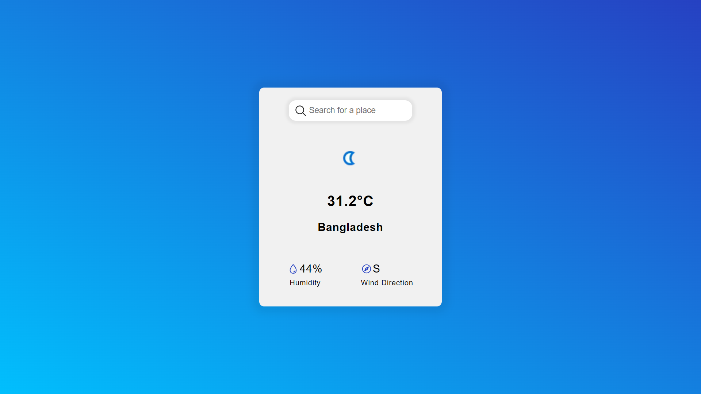

# Weather App

A simple weather application that fetches real-time weather data from the [WeatherAPI](https://www.weatherapi.com/) and displays it dynamically.

## Features
- Search for any city or country
- Get real-time temperature, weather conditions, and icons
- Uses [WeatherAPI](https://www.weatherapi.com/) for live data
- Responsive design

## Technologies Used
- HTML
- CSS
- JavaScript 
- WeatherAPI

## Installation
1. Clone the repository:
   ```bash
   git clone https:/khairul25556/github.com//weather-app.git
   ```
2. Navigate to the project folder:
   ```bash
   cd weather-app
   ```
3. Open `index.html` in a browser.

## Usage
1. Enter a city or country in the search bar.
2. Click the search icon or press **Enter**.
3. View real-time weather information including:
   - Temperature in Celsius
   - Weather conditions (e.g., Sunny, Cloudy)
   - Weather icon

## API Integration
This project uses **WeatherAPI**. To use your own API key:
Sign up at [WeatherAPI](https://www.weatherapi.com/) and get a free API key.

## Screenshots


## Contributing
Feel free to contribute by submitting a pull request.


